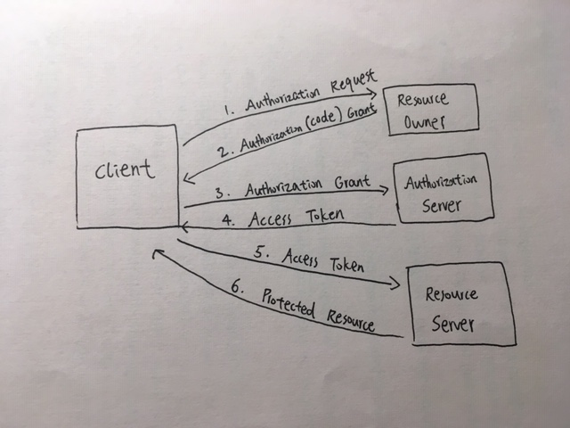

# LAB - 13

## Bearer Authorization

### Author: David Zheng 

### Links and Resources
* [submission PR](https://github.com/davidzheng-401d32/Lab-13/pull/1)
* [travis](https://travis-ci.com/davidzheng-401d32/Lab-13)
* [back-end](https://davidzheng-lab13.herokuapp.com/) (when applicable)

#### Documentation
* [jsdoc](https://davidzheng-lab13.herokuapp.com/docs) (link is not working at the moment, I have added all the configs/scripts for jsdocs)

### Setup
#### `.env` requirements
* `PORT` - 3000
* `MONGODB_URI` - mongodb://localhost:27017/db

  
#### Tests
unit test: `npm test`
lint test: `npm run lint`

#### UML
